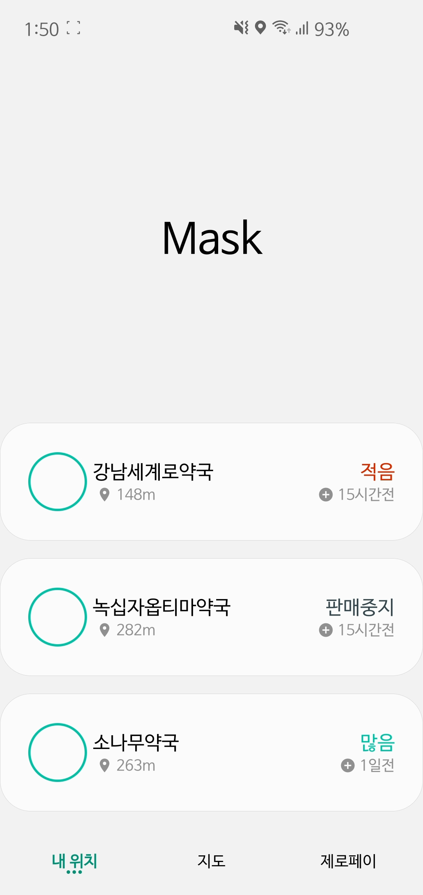
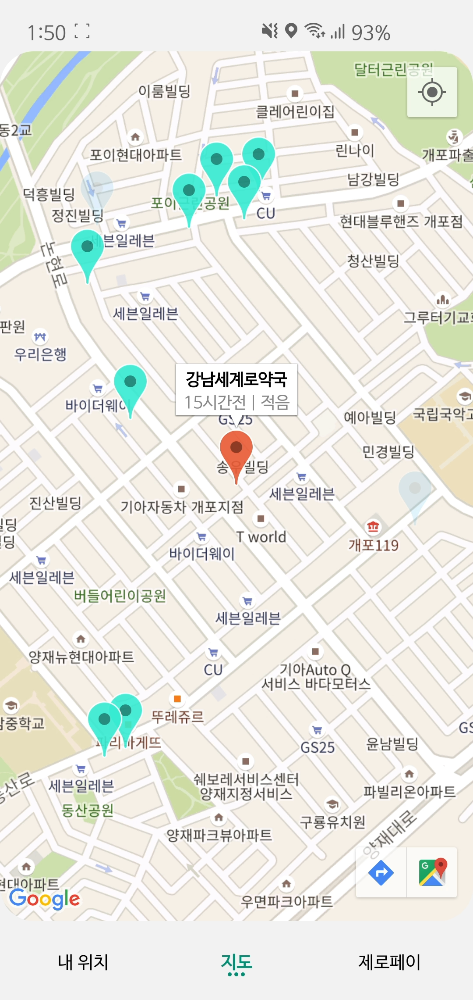
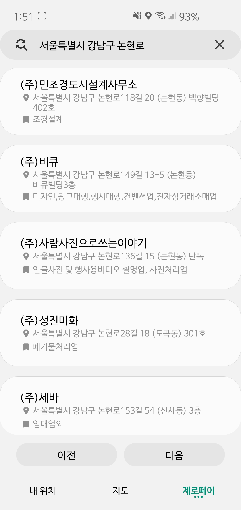
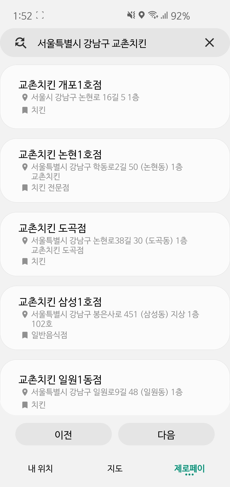

# Mask
### 공공데이터 포털 OpenAPI를 활용한 공적마스크 및 제로페이 가맹점 현황 앱
### 공적 마스크 공급 중단으로 사용된 OpenAPI 서비스가 중지되었으며 해당 앱도 사용이 불가능합니다.

 

  
 

 

----------------------------------------

## 기능

### 내 위치
- 사용자의 위치 정보를 통해 주변 공적 마스크 판매점의 현황을 목록으로 보여줍니다.

### 지도
- 목록의 판매점 현황을 클릭하거나 지도 탭으로 이용하여 공적 마스크 판매점의 위치와 현황을 쉽게 알 수 있습니다.
- 사용자 위치를 기준으로 주변에 판매점이 20개 미만일 경우 5km까지 점진적으로 검색합니다.

### 제로페이 가맹점
- 긴급생활지원금의 가맹점인지 사용자가 확인하고 싶을 때, 이 기능을 이용해 검색해 가맹점 정보를 확인할 수 있습니다. 
- 검색 방식 변경 버튼을 이용해 도로명 주소, 상호명 검색 방식으로 전환할 수 있습니다.

-----------------------------------------------
